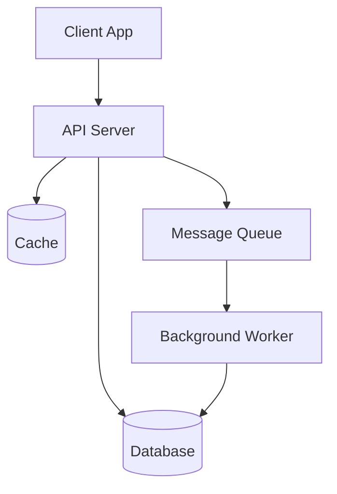
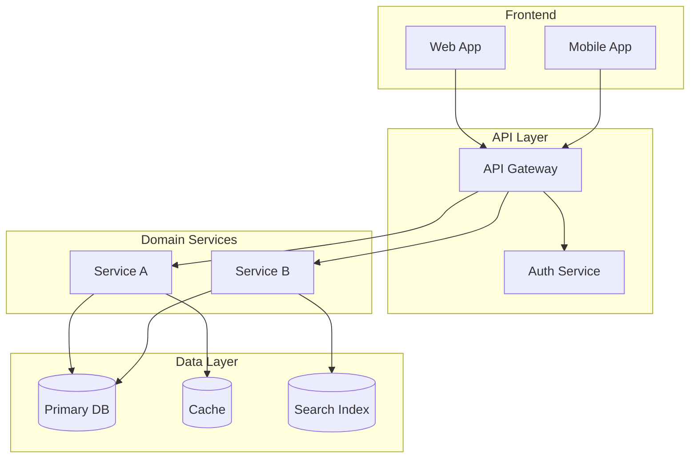
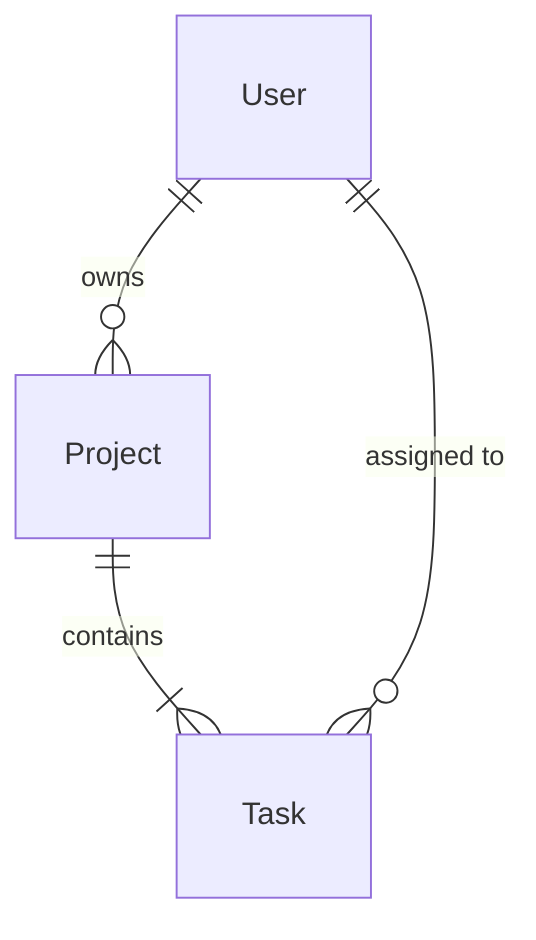
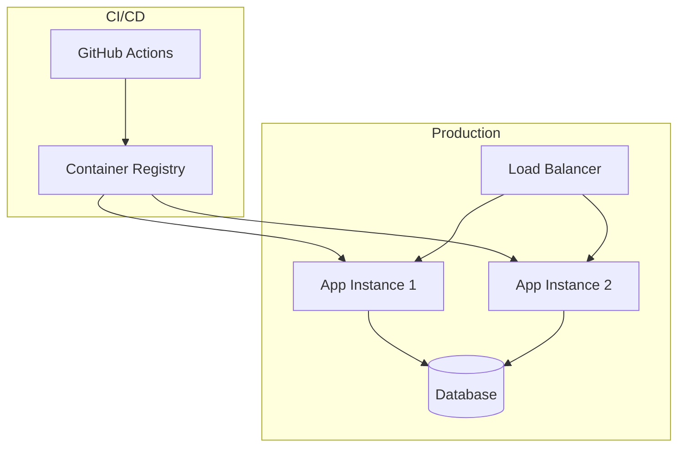

# techdocs — Document Templates (Phase 4)

> **CodeOps Skills Version**: 3.12.0

Canonical templates for every document in the VitePress `docs/` tree. Write a file from the
matching template, then fill the bracketed placeholders with real, verified project details. Only
create the sections relevant to the project type (see the adaptation table in SKILL.md). Replace
every `[YYYY-MM-DD]` "Last Updated" stamp with today's date when you write or update a file.

---

## `docs/index.md` — System overview (entry point)

This is the root document **and** the techdocs opt-in marker (`techdocs: true`).

````markdown
---
techdocs: true
---

# [Project Name] — Technical Architecture

> **Project**: [Project Name]
> **Type**: [SaaS / API / Library / CLI / etc.]
> **Tech Stack**: [Key technologies]
> **Last Updated**: [YYYY-MM-DD]

---

## System Purpose

[2-3 paragraphs: What this system does, who it's for, and why it exists.
Written for a developer who has never seen the project before.]

## Architecture at a Glance



## Key Components

| Component | Technology | Purpose | Documentation |
|-----------|-----------|---------|---------------|
| [Component] | [Tech] | [Purpose] | [Link to detail doc] |

## Technology Decisions

See [Architecture Decision Records](/decisions/) for the rationale behind all major
technology and design choices.

## Getting Started

New to the project? Start with the [Getting Started Guide](/guides/getting-started).
````

---

## `docs/architecture/system-overview.md`

````markdown
# System Overview

> **Last Updated**: [YYYY-MM-DD]

## Architecture Style

[Describe the overall architecture: monolith, microservices, serverless, event-driven, etc.
Explain WHY this style was chosen.]

## Component Architecture

[Detailed component diagram — more detailed than index.md]



## Component Responsibilities

### [Component Name]

- **Purpose**: [What it does]
- **Technology**: [What it's built with]
- **Inputs**: [What data/events it receives]
- **Outputs**: [What data/events it produces]
- **Dependencies**: [What it depends on]

[Repeat for each major component]

## Communication Patterns

| From | To | Protocol | Pattern | Notes |
|------|-----|----------|---------|-------|
| [Component] | [Component] | [REST/gRPC/Events/etc.] | [Sync/Async] | [Notes] |

## Cross-Cutting Concerns

- **Authentication**: [How auth works across the system]
- **Logging**: [Logging strategy and tools]
- **Monitoring**: [Monitoring approach]
- **Error Handling**: [System-wide error handling strategy]
````

---

## `docs/architecture/data-model.md`

````markdown
# Data Model

> **Last Updated**: [YYYY-MM-DD]

## Domain Model



## Entities

### [Entity Name]

| Field | Type | Constraints | Description |
|-------|------|------------|-------------|
| id | UUID | PK | Unique identifier |
| [field] | [type] | [constraints] | [description] |

**Relationships:**
- Has many [Related Entity] (via [foreign key])
- Belongs to [Related Entity] (via [foreign key])

**Business Rules:**
- [Rule 1]
- [Rule 2]

[Repeat for each entity]

## Data Flow

[Describe how data flows through the system — creation, transformation, storage, retrieval]

## Migration Strategy

[How database migrations are handled, tooling used, rollback procedures]
````

---

## `docs/architecture/api-design.md`

````markdown
# API Design

> **Last Updated**: [YYYY-MM-DD]

## API Style

[REST / GraphQL / gRPC / mixed — and why]

## Authentication

[How API authentication works — JWT, API keys, OAuth, session tokens]

## Conventions

- **Base URL**: `[base url]`
- **Versioning**: [Strategy — URL path, header, query param]
- **Pagination**: [Strategy — cursor, offset, keyset]
- **Error Format**: [Standard error response shape]

## Endpoint Groups

### [Resource Group]

| Method | Endpoint | Description | Auth |
|--------|----------|-------------|------|
| GET | `/api/v1/[resource]` | List [resources] | [Required/Public] |
| POST | `/api/v1/[resource]` | Create [resource] | [Required/Public] |
| GET | `/api/v1/[resource]/:id` | Get [resource] | [Required/Public] |
| PUT | `/api/v1/[resource]/:id` | Update [resource] | [Required/Public] |
| DELETE | `/api/v1/[resource]/:id` | Delete [resource] | [Required/Public] |

[Repeat for each resource group]

## Error Handling

| Status Code | Meaning | Response Shape |
|-------------|---------|----------------|
| 400 | Bad Request | `{ error: string, details: [...] }` |
| 401 | Unauthorized | `{ error: string }` |
| 403 | Forbidden | `{ error: string }` |
| 404 | Not Found | `{ error: string }` |
| 500 | Internal Error | `{ error: string }` |

## Rate Limiting

[Rate limiting strategy, limits per endpoint category, response headers]
````

---

## `docs/architecture/infrastructure.md`

````markdown
# Infrastructure

> **Last Updated**: [YYYY-MM-DD]

## Deployment Architecture



## Environments

| Environment | Purpose | URL | Infrastructure |
|-------------|---------|-----|---------------|
| Development | Local development | localhost:XXXX | Docker Compose |
| Staging | Pre-production testing | [URL] | [Platform] |
| Production | Live system | [URL] | [Platform] |

## Container Architecture

[Docker setup, base images, multi-stage builds, compose configuration]

## CI/CD Pipeline

[Pipeline stages, triggers, deployment strategy]

## Secrets Management

[How secrets are stored, rotated, and injected — NEVER list actual secrets]

## Backup & Recovery

[Backup strategy, recovery procedures, RPO/RTO targets]

## Monitoring & Alerting

[What is monitored, alerting thresholds, incident response]
````

---

## `docs/architecture/security.md`

````markdown
# Security Architecture

> **Last Updated**: [YYYY-MM-DD]
> **See also**: your project's security coding standards (AGENTS.md) for implementation-level standards

## Threat Model

[High-level threat model — what are we protecting, from whom?]

| Asset | Threat | Mitigation | Status |
|-------|--------|------------|--------|
| [Asset] | [Threat] | [How it's mitigated] | ✅ Implemented / ⏳ Planned |

## Authentication Architecture

[Auth flow, token lifecycle, session management]

## Authorization Model

[RBAC / ABAC / ACL — how permissions work]

| Role | Permissions | Scope |
|------|------------|-------|
| [Role] | [What they can do] | [Where it applies] |

## Data Protection

- **Encryption at rest**: [Strategy]
- **Encryption in transit**: [TLS configuration]
- **PII handling**: [What PII exists, how it's protected]
- **Data retention**: [Retention policies, deletion procedures]

## Input Validation & Injection Prevention

[System-wide input validation strategy, which libraries/frameworks handle this]

## Infrastructure Security

- **Container security**: [Non-root users, minimal images, vulnerability scanning]
- **Network security**: [Firewall rules, VPC, network segmentation]
- **Secrets management**: [Vault, env vars, CI/CD secrets — approach, not actual secrets]
- **Dependency management**: [Audit tools, update cadence, vulnerability response]
````

---

## `docs/decisions/index.md` — ADR log

````markdown
# Architecture Decision Records

This log tracks all significant architecture and design decisions made for [Project Name].
Each decision is documented with context, options considered, and rationale.

## Decision Log

| # | Date | Decision | Status |
|---|------|----------|--------|
| [ADR-001](ADR-001-short-name.md) | YYYY-MM-DD | [Brief title] | ✅ Accepted |
| [ADR-002](ADR-002-short-name.md) | YYYY-MM-DD | [Brief title] | ✅ Accepted |

## How to Read ADRs

Each ADR follows a standard format:
- **Context**: What situation or problem triggered this decision?
- **Decision**: What was decided?
- **Rationale**: Why was this chosen over alternatives?
- **Consequences**: What are the trade-offs and implications?

## When to Create an ADR

Create a new ADR when:
- Choosing a technology, framework, or library
- Deciding on an architecture pattern or style
- Choosing between multiple valid approaches
- Making a decision that would be hard to reverse
- Making a decision that future developers will question
````

---

## ADR template — `docs/decisions/ADR-XXX-[short-name].md`

````markdown
# ADR-XXX: [Decision Title]

> **Date**: YYYY-MM-DD
> **Status**: Proposed | Accepted | Deprecated | Superseded by [ADR-XXX]
> **Source**: [RD-XX / Plan: feature-name / Ad-hoc — where this decision originated]

## Context

[What is the situation? What problem or question triggered this decision?
Include technical context, constraints, and requirements.]

## Options Considered

### Option A: [Name]

- **Pros**: [advantages]
- **Cons**: [disadvantages]

### Option B: [Name]

- **Pros**: [advantages]
- **Cons**: [disadvantages]

### Option C: [Name] (if applicable)

- **Pros**: [advantages]
- **Cons**: [disadvantages]

## Decision

[What was decided? State it clearly in one sentence.]

**Chosen option**: [Option X], because [one-line rationale].

## Rationale

[Detailed explanation of why this option was chosen. Reference specific requirements,
constraints, or trade-offs that made this the best choice.]

## Consequences

### Positive

- [Benefit 1]
- [Benefit 2]

### Negative

- [Trade-off 1]
- [Trade-off 2]

### Risks

- [Risk and how it will be mitigated]
````

---

## `docs/guides/getting-started.md`

````markdown
# Getting Started

> **Last Updated**: [YYYY-MM-DD]

## Prerequisites

| Tool | Version | Installation |
|------|---------|-------------|
| [Tool] | [Version] | [Link or command] |

## Setup

### 1. Clone the Repository

```bash
git clone [repository-url]
cd [project-name]
```

### 2. Install Dependencies

```bash
[install command]
```

### 3. Configure Environment

```bash
cp .env.example .env
# Edit .env with your local configuration
```

### 4. Start Development

```bash
[dev start command]
```

### 5. Verify Setup

```bash
[verify/test command]
```

## Project Structure

```
[Directory tree with descriptions — keep synchronized with actual structure]
```

## Common Tasks

| Task | Command |
|------|---------|
| Run tests | `[command]` |
| Build | `[command]` |
| Lint | `[command]` |
| Database migration | `[command]` |

## Next Steps

- Read the [System Overview](/architecture/system-overview) to understand the architecture
- Review [Architecture Decisions](/decisions/) to understand why things are built this way
- Check the [Development Guide](/guides/development) for coding conventions
````

---

## `docs/guides/development.md`

````markdown
# Development Workflow

> **Last Updated**: [YYYY-MM-DD]

## Coding Conventions

[Project-specific conventions — naming, file organization, patterns used.
Reference the project's AGENTS.md (or detected project conventions) if it exists.]

## Branch Strategy

[Git workflow — trunk-based, GitFlow, feature branches, etc.]

## Testing Strategy

[How to write and run tests, what coverage is expected, test file organization.
Follow your project's testing standards (AGENTS.md).]

## Code Review

[Code review process, what to look for, how to give/receive feedback]

## Common Patterns

### [Pattern Name]

[Description and code example of a common pattern used in this project]

[Repeat for each pattern]
````

---

## `docs/guides/deployment.md`

````markdown
# Deployment

> **Last Updated**: [YYYY-MM-DD]

## Environments

| Environment | Branch | Auto-Deploy | URL |
|-------------|--------|-------------|-----|
| [Env] | [Branch] | [Yes/No] | [URL] |

## Deployment Process

### [Environment Name]

1. [Step 1]
2. [Step 2]
3. [Step 3]

## Configuration

[Environment-specific configuration, how to set environment variables]

## Rollback Procedure

[How to roll back a deployment if something goes wrong]

## Health Checks

[How to verify a deployment is healthy]
````

---

## `docs/reference/configuration.md`

````markdown
# Configuration Reference

> **Last Updated**: [YYYY-MM-DD]

## Environment Variables

| Variable | Required | Default | Description |
|----------|----------|---------|-------------|
| `[VAR]` | [Yes/No] | [Default] | [Description] |

## Feature Flags

| Flag | Default | Description |
|------|---------|-------------|
| `[FLAG]` | [Value] | [Description] |

## Configuration Files

### [Config File Name]

[Description, location, format, key options]
````

---

## `docs/reference/integrations.md`

````markdown
# External Integrations

> **Last Updated**: [YYYY-MM-DD]

## Integration Map

| System | Protocol | Direction | Purpose | Auth |
|--------|----------|-----------|---------|------|
| [System] | [REST/gRPC/SMTP/etc.] | [In/Out/Both] | [Purpose] | [Auth method] |

## [Integration Name]

### Overview

[What this integration does and why it exists]

### Configuration

[How to configure the integration — env vars, API keys, endpoints]

### Data Flow

[What data is exchanged, format, frequency]

### Error Handling

[What happens when the integration is unavailable, retry strategy]

### Testing

[How to test the integration locally — mocks, sandboxes, test accounts]
````
